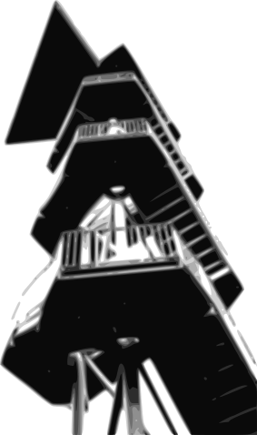

:github_url:

scherbelberg - HPC cluster deployment and management for the Hetzner Cloud
==========================================================================

*/ˈʃɛʁbɛlbɛʁk/* - German, toponym, male: "`mountain of shards`_" in Leipzig

.. _mountain of shards: https://commons.wikimedia.org/wiki/Category:Rosentalh%C3%BCgel_(Leipzig)

.. .. |build_master| image:: https://github.com/pleiszenburg/scherbelberg/actions/workflows/test.yaml/badge.svg?branch=master
.. 	:target: https://github.com/pleiszenburg/scherbelberg/actions/workflows/test.yaml
.. 	:alt: Test Status: master / release
.. |docs_master| image:: https://readthedocs.org/projects/scherbelberg/badge/?version=latest&style=flat-square
	:target: https://scherbelberg.readthedocs.io/en/latest/
	:alt: Documentation Status: master / release
.. |license| image:: https://img.shields.io/pypi/l/scherbelberg.svg?style=flat-square
	:target: https://github.com/pleiszenburg/scherbelberg/blob/master/LICENSE
	:alt: BSD
.. |status| image:: https://img.shields.io/pypi/status/scherbelberg.svg?style=flat-square
	:target: https://github.com/pleiszenburg/scherbelberg/issues
	:alt: Project Development Status
.. |pypi_version| image:: https://img.shields.io/pypi/v/scherbelberg.svg?style=flat-square
	:target: https://pypi.python.org/pypi/scherbelberg
	:alt: pypi version
.. |conda_version| image:: https://img.shields.io/conda/vn/conda-forge/scherbelberg.svg?style=flat-square
	:target: https://anaconda.org/conda-forge/scherbelberg
	:alt: conda version
.. |pypi_versions| image:: https://img.shields.io/pypi/pyversions/scherbelberg.svg?style=flat-square
	:target: https://pypi.python.org/pypi/scherbelberg
	:alt: Available on PyPi - the Python Package Index
.. .. |chat| image:: https://img.shields.io/matrix/scherbelberg:matrix.org.svg?style=flat-square
.. 	:target: https://matrix.to/#/#scherbelberg:matrix.org
.. 	:alt: Matrix Chat Room
.. .. |mailing_list| image:: https://img.shields.io/badge/mailing%20list-groups.io-8cbcd1.svg?style=flat-square
.. 	:target: https://groups.io/g/scherbelberg-dev
.. 	:alt: Mailing List

.. .. |build_master|

|docs_master| |license| |status| |pypi_version| |conda_version| |pypi_versions|

.. .. |chat| |mailing_list|

User's guide
------------

*scherbelberg* provides both a **CLI** and a **Python API** for deploying and managing small **Dask-based HPC clusters in the Hetzner cloud**. Development status alpha, stability acceptable, security also acceptable but implementation needs a review.

.. toctree::
   :maxdepth: 2
   :caption: Introduction

   about
   installation
   gettingstarted

.. toctree::
   :maxdepth: 2
   :caption: Reference

   cli
   api

.. toctree::
   :maxdepth: 2
   :caption: Advanced

   security
   debugging
   changes
   faq
   contributing
   support

Indices and Tables
==================

* :ref:`genindex`
* :ref:`modindex`
* :ref:`search`
